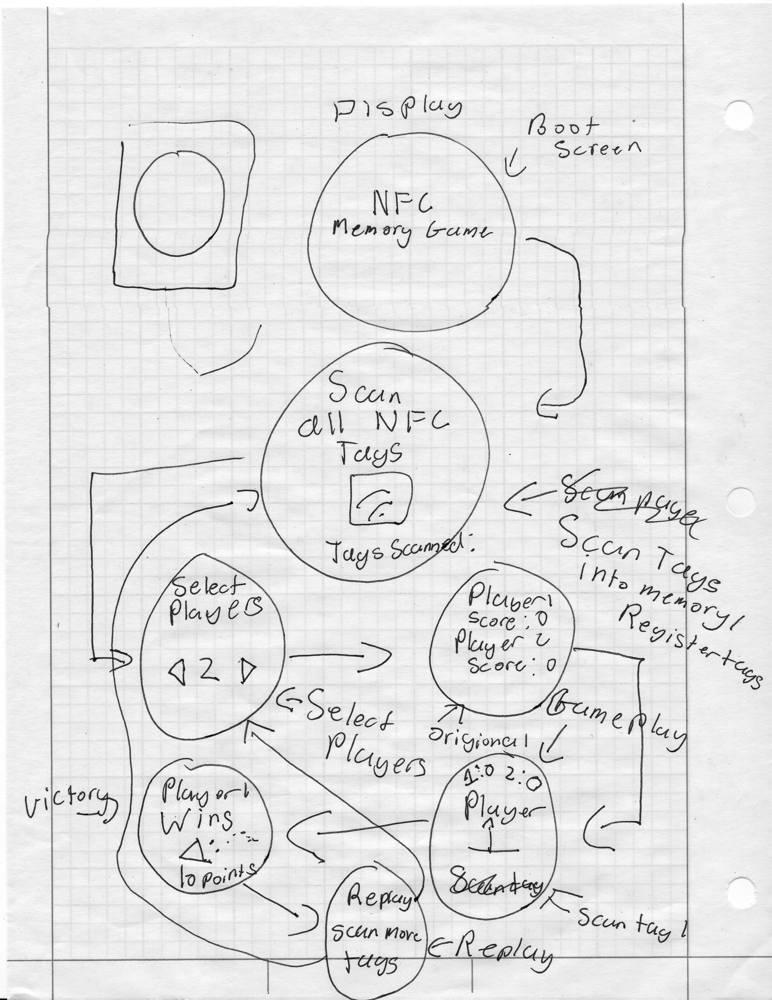

# NFC Memory Game 

A physical memory-match game built on a Raspberry Pi Pico 2 W — players tap NFC tags to "flip" cards, take turns finding pairs, and can check live stats on a web dashboard from any phone or laptop on the same network.

## Project Overview

| File | Purpose | Summary |
|---|---|---|
| `main.py` | Core game | Boots the display, RC522, and encoder; runs the full state machine (register tags → select players → gameplay → victory) and serves the web dashboard. |
| `minimal_rc522.py` | RC522 driver | Hand-written, register-level SPI driver for the RC522 reader — reads tag UIDs with no 3rd-party library. |
| `web.py` | Networking | WiFi connection, NTP time sync, and a lightweight non-blocking HTTP server. |
| `wifi_config.py` | Config | Your WiFi SSID/password — fill in before flashing. |
| `tags.json` | Data *(generated)* | Registered tag UIDs, persisted across reboots; pairs = consecutive entries. |
| `game_log.json` | Data *(generated)* | Rolling log of the last ~50 games (timestamp, players, scores, winner) for the dashboard. |
| `Understanding.md` | Docs | The concepts — *why* each part of the build works the way it does. |
| `Process.md` | Docs | The build log — *how* we wired and coded each step, in order. |

## What this became

What started as "read a tag's UID" grew into a full turn-based multiplayer game with persistent tag memory, a hand-rolled RC522 driver instead of a third-party one, a polished on-device UI with animated feedback, and a WiFi dashboard logging game history over time. It was built incrementally — RC522 alone, then the display, then the encoder, then tag storage, then game logic, then polish, then networking — with each piece tested on real hardware before the next was added. `Process.md` walks through that path in full; `Understanding.md` covers the concepts (SPI, interrupts, state machines, sockets) that made each step make sense rather than just work.

## Quick start
1. Flash [Pimoroni's RP2350 MicroPython](https://github.com/pimoroni/pimoroni-pico-rp2350/releases/latest)
2. Wire per `Process.md` §1–3
3. Copy all `.py` files to the Pico, fill in `wifi_config.py`
4. Scan tags in pairs → hold to start → play

# RFID Game Brainstorm/Explanation

## Step 1: Learn how NFC code works
- Wire the display up to the Pi Pico
- Get some return data off the NFC tags
- RFID info: RC 522
## Step 2: Learn how the display works & how
- Display info: 1.28 in TFT 240x240 GC9A01
 - Drivers
- Display text and images 
## Step 3: Combine screen and results from RFID
- Show NFC tag data on the screen
## Step 4: Add input device
- Add a 5 pin rotary encoder
- Spin to select
- Click to confirm
## Step 5: Create tag memory script and assign pairs
- Put all of the tags in the Pi's permanent memory
- Be able to add and remove tags
- Be able to select with the rotary encoder
## Step 6: Create the game and make it playable
- Make a game of memory  using NFC tags as the cards
- Assign turns and make players scan 2 tags at a time and if they are pairs give them a point if not do nothing, once all of the pairs have been made show the final score.
- Combine all of the previous steps to create this game
## Step 7: Beautify the game
- Make the interface intuitive and interactive
- Make it look nice to the people playing the game
- For example: 
 